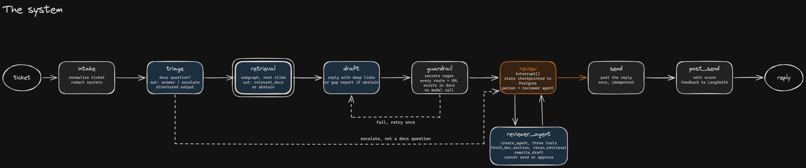

# API documentation support automation

A LangGraph pipeline that takes a developer support ticket from a spoofed
ServiceNow instance, finds the API docs that actually answer it, drafts a reply
with deep links, checks the draft, and stops for a human reviewer who can talk
to a small agent before approving. Approval posts the reply back to ServiceNow
and writes an edit score to LangSmith.



```
intake -> triage
triage --route_after_triage--> retrieval | review
retrieval -> draft
draft -> guardrail
guardrail --route_after_guardrail--> review | draft
review --route_after_review--> reviewer_agent | send
reviewer_agent -> review
send --route_after_send--> post_send | review
post_send -> END
```

Inside the retrieval subgraph:

```
plan_queries --fan_out (Send)--> search (x N) -> reflect
reflect --route_after_reflect--> plan_queries | END
```

## Requirements

- [uv](https://docs.astral.sh/uv/) (installs Python 3.12 for you)
- Docker, for Postgres. The graph checkpoints to it and the fake ServiceNow
  tables live in it.
- An [OpenAI API key](https://platform.openai.com/api-keys)
- LangSmith is optional. `LANGSMITH_TRACING` defaults to `false` in
  `app/settings.py`, so the demo runs without a LangSmith key. Set it to `true`
  and add `LANGSMITH_API_KEY` to `.env` if you want traces and feedback.

## Quickstart

```sh
cp .env.example .env    # fill in OPENAI_API_KEY
uv sync
scripts/demo.sh
```

`scripts/demo.sh` starts Postgres on `localhost:5433` with `docker compose`,
resets the checkpoint and ServiceNow tables, seeds the queue from
`fixtures/tickets/*.json`, runs one ticket to the review stop, and opens the
Streamlit review page. `scripts/demo.sh reset`, `scripts/demo.sh run <id>`, and
`scripts/demo.sh ui` do each piece on its own.

## Usage

The same steps from the CLI:

```sh
# the ServiceNow queue
uv run python -m app.demo list

# run one ticket to the human review interrupt, then the process exits
uv run python -m app.demo run --ticket fixtures/tickets/l1_001.json
uv run python -m app.demo run --ticket fixtures/tickets/l1_001.json --no-cache
uv run python -m app.demo run --ticket fixtures/tickets/l1_001.json --mode semantic_only

# a different process picks the thread back up out of Postgres
uv run python -m app.demo status --thread l1_001
uv run python -m app.demo resume --thread l1_001 --chat "does backoff exist in v2?"
uv run python -m app.demo resume --thread l1_001 --approve --tag fixed_facts
uv run python -m app.demo resume --thread l1_001 --escalate --note "billing, not docs"
```

`resume --approve` also takes `--final-file <path>` (the reviewer's edited text),
`--save-to-kb`, and `--save-to-eval`. A second `resume` on a finished thread is a
no-op. `sn_replies` has a primary key on `ticket_id`, and send checks state first.

## Evals

Both need `LANGSMITH_API_KEY` in `.env`.

```sh
uv run python evals/run_experiment.py --mode hybrid
uv run python evals/run_experiment.py --mode hybrid --retrieval
```

The first runs the whole graph against the golden set, three repetitions, six
evaluators. The second runs the retrieval subgraph alone against the retrieval
set, one repetition, three evaluators. `--mode semantic_only` is the ablation
that turns every exact lookup into a semantic one. Numbers are in
[docs/eval-results.md](docs/eval-results.md).

## Tests

```sh
uv run pytest
```

The smoke test runs the whole graph on `InMemorySaver` with an inline knowledge
base and monkeypatched ServiceNow, so it needs no Postgres, no provider, and no
network.

## Docs

- [docs/rfc.md](docs/rfc.md), the design and why it looks this way
- [docs/eval-results.md](docs/eval-results.md), the numbers
- [docs/tuning-log.md](docs/tuning-log.md), before and after each change
- [docs/friction-log.md](docs/friction-log.md), rough edges hit with LangChain,
  LangGraph, and LangSmith. The friction log lives here.

## Worth knowing

- **The retrieval subgraph is composed with a wrapper function**, not by dropping
  the compiled subgraph in as a node. The parent never sees `queries`, `results`,
  or the loop counter; it gets `relevant_docs` and `retrieval_stats` back and
  nothing else.
- **The three-pass cap is on the edge, not in the model.** `route_after_reflect`
  checks the counter. The model can ask to loop forever and it will not get to.
- **Review is two nodes, not one.** `interrupt()` re-runs its node from the top
  on resume, so a single node holding the whole reviewer conversation would
  replay every earlier agent turn on every resume. `review` takes one human turn,
  `reviewer_agent` takes one agent turn, and an edge joins them.
