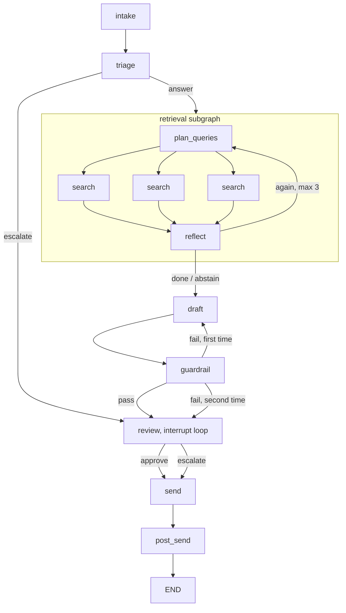

# RFC. API documentation support ticket assistant

Written 2026-09-03, before the build. This document says what the system is, how each part works, and why. Where the build ended up differing in detail, the code and `docs/eval-results.md` win.


---

## 0. The system in one paragraph

A support ticket arrives from a spoofed ServiceNow. A triage step decides if the ticket is a documentation question at all. If it is, a retrieval subgraph plans one to three searches, runs them in parallel against the API docs, reads the results, and decides if it has enough, needs another pass, or has to admit the docs do not cover this. A draft step writes an answer with deep links into the docs, or a gap report if retrieval came up empty. A guardrail step runs regex checks for leaked secrets and confirms every route and link in the draft came from the retrieved docs. The graph then pauses. A human picks the ticket off a queue, reads the draft next to the docs, and works with a small agent that can look things up and rewrite. The human approves. A send step posts the answer back to ServiceNow. A final step measures how much the human changed the draft, writes that score to LangSmith, and saves the approved answer into the knowledge base pinned to the API version it was written against.

Everything in that paragraph is a node in one LangGraph graph. One agent loop exists, the reviewer. Everything else is a plain model call with a fixed output schema, or plain code.

---

## 1. Problem and stakeholder framing

### 1.1 Who is in the room

Two people. The VP of Developer Support owns the team that answers tickets and the number that says how long a bank waits for an answer. The platform architect owns whatever runs inside their network and will ask how this thing fails.

### 1.2 The pain

This is Alex's framing from the original engagement, and it is the framing the deck reuses.

> The company provides API services to major banks. When developers at those banks had questions, they'd submit support tickets, and the company's customer service agents had to answer them. The problem was these agents were drowning. Hundreds of API endpoints, thousands of pages of documentation, and a lot of the knowledge lived in the heads of senior people who'd been there for years. For the basic stuff they saw the same questions over and over. For the complex stuff it could take a full day to put together a response. And these are major banks waiting on answers for how to integrate.

Three things make this hard, and all three appear in the design.

1. The answer is spread across documentation that has versions. A route exists in v2 and v3 with different behavior, or exists in v2 and is gone in v3. A confident answer against the wrong version is worse than no answer.
2. Routes have near-identical names. `/payments/refund` and `/payments/reversal` do different things. Similarity search treats them as the same.
3. Some tickets cannot be answered from the docs. Either the docs do not cover it, or the ticket is not a docs question at all. The system has to know the difference and say so.

### 1.3 The goal

Cut the time a support agent spends on a ticket, without letting a wrong answer reach a bank. In the original engagement level one tickets went from about two hours to about two minutes, and complex tickets from a day to about thirty minutes once the support agents started using the system as a search partner.

### 1.4 What success looks like for this MVP

One LangSmith experiment on a golden set. The headline number is how often the draft is correct on tickets the docs can answer. The second number is how often the system picks the right disposition, answer or abstain or escalate. Alex's framing for the deck is that correctness is the value and disposition accuracy is the safety.

If the correctness number is high enough, the stakeholder decision is to move from this assisted mode to shadow testing with real support agents. If it is not, the retrieval eval tells you whether to fix search or fix drafting.

A second run of the same experiment with retrieval forced to semantic-only exists to show the cost of the alternative. Near-miss tickets should regress visibly. That turns the "exact index primary" decision from a claim into a number.

### 1.5 Why this is real enterprise complexity

The prompt asks for it and the interviewers grade on it. The honest answer is the list in 1.2 plus the human. Versioned docs, near-miss routes, and unanswerable tickets are retrieval problems most demos skip. And a human sits inside the loop, not at the end of it. The human can send the system back to the docs and the system learns from what the human changed. That loop is the part Alex found by accident last time and designed on purpose this time.

---

## 2. Architecture overview

### 2.1 The graph



Draw the retrieval subgraph as one box on the top-level diagram and zoom into it separately. The top level has eight nodes. Keep it looking like eight.

### 2.2 Every node in one line

| Node | Does | Model call |
|---|---|---|
| intake | Reads a ticket from the spoof ServiceNow, normalizes it into state | none |
| triage | Picks `answer` or `escalate` | yes, structured |
| retrieval subgraph | Finds the docs the drafter needs, or says the docs do not cover this | yes, planner and reflect |
| draft | Writes the answer with deep links, or a gap report | yes |
| guardrail | Regex for secrets, check that every route and link is grounded | none |
| review | Pauses the graph. Human works with the reviewer agent. Ends on approve or escalate | yes, the reviewer agent |
| send | Posts the final answer to the spoof ServiceNow once | none |
| post_send | Scores the edit, writes feedback to LangSmith, saves the approved answer | none, except optional tiers |

### 2.3 Every edge that makes a decision

- **triage.** `answer` goes to retrieval. `escalate` skips retrieval and drafting and goes to review at high priority.
- **reflect.** `again` loops to the planner if under three passes. `done` and `abstain` both exit to draft. On abstain the draft node writes a gap report instead of an answer.
- **guardrail.** Pass goes to review. First failure goes back to draft with the reasons in state. Second failure goes to review at high priority with the flags visible.
- **review.** Approve and escalate both go to send. Escalate sends a note to ServiceNow instead of an answer.

### 2.4 Interrupt points

One. Inside the review node. Each turn of the human conversation is one `interrupt()` call, and the agent's reply runs in a sibling node so nothing replays on resume (3.6 explains). The graph checkpoints to Postgres at every turn on the ticket's `thread_id`. The CLI can exit. A different process can resume the ticket tomorrow with the thread id and the same checkpointer.

### 2.5 External integrations

- **Spoof ServiceNow, in.** A `sn_tickets` table in Postgres, seeded from JSON fixtures, that hands out tickets.
- **Spoof ServiceNow, out.** A `sn_replies` table keyed by ticket id that records the final answer once.
- **Knowledge base.** Markdown files on disk, indexed into a local vector store and a plain dict.
- **Postgres.** Checkpointer for graph state.
- **LangSmith.** Tracing on every run, feedback written after send, datasets and experiments for evals.

---

## 3. Component design

Each subsection covers what the component is responsible for, the state it reads and writes, the model call and its output schema if there is one, tools if any, what happens when it fails, and how you eval it on its own.

### 3.1 Intake

**Responsibility.** Pull a ticket from the spoof ServiceNow and put it into state in a known shape.

**Ticket schema.**

```python
class Ticket(TypedDict):
    id: str
    tenant: str            # the bank, one deployment per bank so this is informational
    api_version: str       # "v2" or "v3", what the customer is on
    product_area: str      # "payments" or "webhooks", or "unknown"
    subject: str
    body: str
    created_at: str
```

The metadata matters. `api_version` becomes the default version filter for every search. `product_area` narrows the semantic search when present. In production ServiceNow carries all three because the bank's account record knows what version they integrated against.

**Reads.** Nothing. **Writes.** `ticket`.

**Model call.** None.

**Redaction.** Intake runs the guardrail's `pii_scan` on the ticket subject and body and redacts API keys, bearer tokens, and emails before the ticket is written to state. Nothing downstream, including the LangSmith trace, sees the raw secret. A bank developer pasting a live key into a ticket is the realistic leak, and this is the cheapest place to stop it.

**Failure.** Malformed ticket raises and the graph does not start. This is the one place where failing loud is right.

**Eval.** Unit test with a planted key in the ticket body.

### 3.2 Triage

**Responsibility.** Decide if this ticket is a documentation question. Nothing else.

Alex asked in the design session if this step was needed. It is the first line of defense. Someone threatening to sue, a billing dispute, a security incident, a request to change an account setting. None of those are answerable from API docs. Triage catches them before the system spends a retrieval pass and a draft on them.

**Reads.** `ticket`. **Writes.** `disposition`, `triage_reason`, `priority`.

**Model call.** One structured output call.

```python
class TriageDecision(BaseModel):
    disposition: Literal["answer", "escalate"]
    reason: str    # one sentence, shown to the reviewer on escalate
```

The prompt lists what "escalate" means in this domain and tells the model that when unsure it should pick `answer`, because retrieval will catch the case where the docs do not help and the human sees everything anyway. Triage should err toward looking.

**Failure.** If the model call fails after retries, default to `answer`. A ticket that should have been escalated still reaches a human through the normal path.

**Eval.** Covered by the disposition accuracy column in the main experiment. Escalate examples in the golden set have reference disposition `escalate`.

### 3.3 Retrieval subgraph

This is the part Alex described first and cares about most.

> The first step is a subgraph that looks at the ticket, sees what information it needs to find, it can parallelize, you know, creating queries to go into the documentation, find documentation, come back, reason if that's enough or needs to go back, loop until it says done. Pass only the documentation that's relevant to the next step, and then we have a sub evaluation eval for just that retrieval sub graph.

**Responsibility.** Given the ticket, return the smallest set of doc sections and past approved answers the drafter needs, or return `abstain` if three passes did not find them.

**Composition.** A separate `StateGraph` with its own state schema, wrapped in a function that the parent graph calls as a node. The wrapper takes `ticket` and the `use_cache` config flag in, and returns only `relevant_docs` and `disposition` to the parent. The parent never sees the raw search results. This is how "pass only the documentation that's relevant to the next step" becomes a property of the graph rather than a prompt instruction.

**Internal nodes.**

1. **plan_queries.** One structured output call. Reads the ticket and, on later passes, the `missing` note from reflect. Emits a list of one to three queries.

```python
class SearchQuery(BaseModel):
    mode: Literal["exact", "semantic"]
    route: str | None = None        # "/v2/payments/refund"
    version: str | None = None      # defaults to ticket.api_version
    error_code: str | None = None   # "PAY_4012"
    text: str | None = None         # only used in semantic mode

class QueryPlan(BaseModel):
    queries: list[SearchQuery]      # 1 to 3
```

The planner picks `exact` when it can name a route or an error code from the ticket. It picks `semantic` when the ticket describes a symptom and never names a route. "We get 429s in sandbox but not prod" is semantic. "Does /v3/webhooks/retry support a backoff parameter" is exact.

2. **search.** One branch per query, fanned out with `Send`. Each branch runs one query against the knowledge base and appends hits to a shared `results` list. No model call. Each branch catches its own exceptions and returns an empty list, because one failing branch would otherwise fail the whole batch.

3. **reflect.** One structured output call. Reads the ticket and all results so far. Decides one of three things.

```python
class Reflection(BaseModel):
    decision: Literal["done", "again", "abstain"]
    keep: list[str]        # doc ids the drafter needs, empty on abstain
    missing: str | None    # on "again", what to search for next
```

The conditional edge after reflect reads `decision` and `iteration`. `done` exits. `abstain` exits. `again` goes back to the planner if `iteration < 3`, otherwise forces `abstain`. The counter lives in subgraph state and the edge enforces it, so the model cannot loop forever no matter what it says.

**Why three exits and not two.** From the "5 things missing" list. "Your retrieval loop has 'yes I have enough' and 'no, query again.' It needs a third exit, which is 'I looked three times and the docs don't cover this.' Then the draft node writes a gap report to the human instead of a fake answer." This is the single best thing to defend in the interview, because refusing to answer is the hard part of production RAG.

**What comes out.** `relevant_docs`, a list of the documents whose ids reflect put in `keep`. Each entry has the full section text plus its metadata, so the drafter can cite it and the guardrail can check citations against it.

```python
class Doc(TypedDict):
    doc_id: str
    source: Literal["doc", "approved_answer"]
    route: str
    version: str
    area: str
    status: Literal["current", "deprecated"]
    url: str               # the deep link
    text: str
```

**How the answer cache participates.** Approved answers from past tickets sit in the same two indexes as the docs, tagged `source="approved_answer"` and pinned to a route and version. An exact lookup on a route returns the doc section and any approved answers for that route and version. A semantic lookup can hit an approved answer's text directly. Reflect sees both kinds and decides what to keep. When the graph runs with `use_cache=False` both lookups skip anything tagged `approved_answer`. Eval runs always set this, so the system is graded on the docs alone and not on answers it memorized.

**Failure.** Planner or reflect model failure after retries forces `abstain`. The human gets a gap report that says retrieval errored. Search branch failures return empty and reflect sees fewer results.

**Eval.** Its own LangSmith dataset, derived from the golden set. The 27 non-escalate examples, each with the list of doc ids that should come back, abstain examples expecting none. Score is recall and precision of `relevant_docs` against that list. No model in the loop, pure code. This is the diagnostic. When end-to-end correctness drops, this number says whether search or drafting is to blame. Alex: "we have a certain graph that says when this input comes in, we expect these documents to get retrieved, and I can give scores."

### 3.4 Draft

**Responsibility.** Write the answer the support agent would have written, with deep links, or write a gap report.

**Reads.** `ticket`, `relevant_docs`, `disposition`, `guardrail_flags` on retry. **Writes.** `draft`.

**Model call.** One plain generation. No structured output, the draft is prose. The prompt has four parts.

1. **Role and task.** You are drafting a reply for a support engineer to review. The engineer will edit it before it goes out. Write for a developer at a bank who is integrating against this API.
2. **The docs.** `relevant_docs`, each with its id, route, version, and url. Cite only these. If something is not in these docs, say the docs do not cover it.
3. **Structure and writing rules.** Short answer first. Then the specific route and version. Then a code or config example if the docs have one. Then the deep links. Alex calls this "anti-slop writing techniques." Concretely, no preamble, no "great question," no restating the ticket, no hedging, no bullet lists of things the customer did not ask about, and never invent a route or parameter.
4. **Deep link format.** `[route name](url)` where url comes from the doc's metadata. The guardrail checks these, so the model is told the links will be verified.

On the abstain path the prompt swaps parts 2 and 3 for a gap report format. What the ticket asked. What was searched, from the query plan. What came back and why it did not answer the question. What a human might check next. This goes to the reviewer, not to the customer.

On a guardrail retry the prompt gets a fifth part listing the flags. "Your previous draft cited /v3/payments/void, which is not in the provided docs. Remove or correct it."

**Failure.** Model failure after retries writes a draft that says drafting failed and routes to review at high priority.

**Eval.** The correctness column in the main experiment measures draft quality on the answer path. Groundedness is measured deterministically by the guardrail, and the trajectory checks confirm the gap report was written on abstain examples.

### 3.5 Guardrail

**Responsibility.** Catch two things a human would be embarrassed to send. Leaked secrets, and citations to things that do not exist.

**Reads.** `draft`, `relevant_docs`, `guardrail_attempts`. **Writes.** `guardrail_flags`, `guardrail_attempts`, `priority`.

**Checks.** Both deterministic.

1. **PII and secrets.** Regex for the categories LangChain's `PIIMiddleware` covers, email, credit card, IP, MAC, URL, plus a custom pattern for API keys and bearer tokens, since a bank developer pasting a live key into a ticket is the realistic leak here. The build session checks whether the middleware's detector functions can be imported and reused directly. If not, this is about ten lines of regex.
2. **Groundedness.** Extract every route path and every URL from the draft. Each one must appear in `relevant_docs`. Anything that does not is a flag.

No LLM judge in this node. Alex dropped it in the design session. The human reviewer is the judge of whether the answer makes sense, and the offline eval is the judge of whether it is correct. A third judge in the middle adds latency and cost and would not change what happens next.

**On failure.** First failure writes the flags and routes back to draft. The draft prompt includes the flags, so the second attempt is a real fix and not a coin flip. Second failure routes to review at high priority with the flags visible in the UI. Alex's call in the design session, retry once.

**The same check runs twice more.** `PIIMiddleware` runs inside the reviewer agent on everything the agent reads and writes. And the send node runs the same regex function on `final_answer` before posting, because the human may have pasted something too. Three checkpoints, one policy, and the last one runs on whatever the human approved.

**Eval.** Unit tests with known-bad drafts. A draft with a fake route fails groundedness. A draft with an API key fails PII. Trajectory check confirms no ticket reached send with unresolved flags.

### 3.6 Human review

This is the part the interviewers will ask the most about, and the part Alex's original engagement discovered was the real product.

> Even though the harder questions weren't answered perfectly, they'd started using it as a personal search engine. They'd go back and forth with it, point it at specific sections of the docs, and get to the right answer together way faster than they could on their own.

**Responsibility.** Stop the graph. Let a human read the draft next to the docs, talk to an agent that can look things up and rewrite, and decide. Resume with the decision.

**Reads.** Everything. **Writes.** `draft` through the rewrite tool, `review`, `messages`.

**The queue.** A Streamlit page lists tickets whose graph is paused at review, sorted by `priority` then age. Escalated tickets, abstained tickets, and tickets with guardrail flags sort to the top. Clicking one opens the review screen.

**The review screen.** Three panes. Left is the ticket. Middle is the current draft, editable, with the guardrail flags and the retrieved docs with their links under it. Right is the chat with the reviewer agent. Buttons for approve and escalate, a tag picker, and two checkboxes, save to knowledge base and save to eval set.

**The interrupt loop.** The loop is two nodes joined by edges, not one node that loops.

```
review:          human_input = interrupt(current_state_summary)
                 decision  -> write review, edge to send
                 chat text -> write pending_human, edge to reviewer_agent
reviewer_agent:  run the agent one turn on messages, apply any draft or docs changes, edge back to review
```

Each `interrupt()` checkpoints the whole graph state on the ticket's `thread_id`. The Streamlit page resumes with `Command(resume=human_input)`. Why two nodes. `interrupt()` re-runs its node from the top on resume. If one node held the whole conversation, every resume would replay every earlier agent turn and every rewrite. With the agent turn in its own node, each node run has exactly one interrupt and nothing to replay. On the diagram it is still one box labeled review, with the agent inside it.

**The reviewer agent.** `create_agent` from the `langchain` package. System prompt says you are helping a support engineer finalize a reply, here is the ticket, the draft, and the docs retrieved so far. You can look up docs, re-run the search with a new hint, and rewrite the draft. You cannot approve or send.

Three tools.

| Tool | Does | Returns |
|---|---|---|
| `fetch_doc_section(route, version)` | Exact lookup in the knowledge base | The doc section text and url into the chat |
| `rerun_retrieval(hint)` | Calls the compiled retrieval subgraph with the ticket plus the human's hint | The new `relevant_docs` into the chat and into state |
| `rewrite_draft(instruction)` | Calls the same draft function the draft node uses, with the instruction added | The new draft into `state["draft"]` and a short note into the chat |

`rewrite_draft` is a tool and not something the agent does inline in chat because the draft is a state field with its own pane. Approve needs to know what the current draft is. Edit distance needs two things to diff. The tool is how the agent writes to that field. Under the hood it is one prompt in one place, so the agent and the pipeline write the same way.

`PIIMiddleware` is attached with `apply_to_input` and `apply_to_output`, strategy redact.

Chat memory is one thread per ticket. The agent remembers the whole conversation about this ticket and nothing about any other.

**Why there is no graph edge back to retrieval.** Alex, describing how a review actually goes. "I know this isn't exactly the right answer. Go look at this documentation and bring me back that documentation and let's read that and you formulate another response based on that." That is `rerun_retrieval` followed by `rewrite_draft`. There is no moment where the human says "start over from scratch." So the parent graph does not route backward. The review node exits to send on approve or escalate and nowhere else.

**What the human can do.** Approve as is. Edit the draft by hand in the middle pane. Ask the agent to reword. Ask the agent to go read a specific doc. Ask the agent to search again with a hint. Escalate to a senior engineer. Tick save to knowledge base. Tick save to eval set.

**The decision schema.**

```python
class ReviewDecision(BaseModel):
    action: Literal["approve", "escalate"]
    final_answer: str                 # whatever is in the middle pane at click time
    human_tag: Literal["good_as_is", "fixed_wording", "fixed_facts", "added_context", "escalated"]
    save_to_kb: bool
    save_to_eval: bool
    escalation_note: str | None
```

The human tag is tier 4 of the edit scorer and it costs the reviewer one click.

**Failure.** Agent model failure mid-conversation shows an error in the chat and the human can still edit by hand and approve. The graph is checkpointed at every turn, so a crashed process resumes at the last human turn.

**Eval.** Trajectory check that nothing reached send without a `review` in state. The edit score after send is the online measure of how good the draft was before the human touched it.

### 3.7 Send

**Responsibility.** Post the final answer or escalation note to the spoof ServiceNow, once.

**Reads.** `ticket`, `review`. **Writes.** `sent`.

**Idempotency, plainly.** Before posting, check `sent` in state and check the spoof endpoint for this ticket id. If either says sent, skip. After posting, write `sent` with a timestamp. This matters because a graph that crashes right after the HTTP call and resumes from the checkpoint would otherwise post twice.

**PII re-check.** Run the guardrail's regex function on `final_answer`. If it trips, write the flag and route back to review. The human sees why.

**Failure.** HTTP failure retries three times then leaves the ticket in state as unsent with an error. The queue UI shows it.

**Eval.** Trajectory check that `sent` is only true when `review.action` exists.

### 3.8 Post-send

**Responsibility.** Turn what the human did into a label, and turn what the human approved into knowledge.

**Reads.** `draft` as it was before review, `review`, `ticket`, `relevant_docs`. **Writes.** `edit_score`.

The draft before review has to be captured. The rewrite tool overwrites `draft`, so the parent state keeps `first_draft` written once by the draft node and never touched again.

**Edit distance, four tiers.** Alex's design, in order of cost.

1. **Identifier diff.** Extract routes, versions, error codes, and URLs from `first_draft` and `final_answer`. Same set means a style edit. Different set means a correctness edit. Pure code.
2. **Embedding similarity.** Embed both, compare, threshold. Below the threshold is a big edit. The threshold needs real pairs to calibrate, which do not exist yet.
3. **LLM judge.** Only when tiers 1 and 2 disagree or are inconclusive. Cheap model.
4. **Human tag.** From `ReviewDecision.human_tag`. Free.

Tiers 1 and 4 are built. Tiers 2 and 3 are described.

**Disposition misses, the second free label.** The pipeline said `answer`, `abstain`, or `escalate`. The reviewer then approved or escalated. Escalate on a ticket triage marked `answer` is a triage miss. Approve with a real answer on a ticket retrieval marked `abstain` is a false abstain. Post-send compares the two and writes `disposition_miss` as feedback. Correctness and disposition each now have an offline metric and an online signal, and the annotation queue rule can pull either kind.

**Feedback to LangSmith.** `client.create_feedback(run_id, key="edit_tier", score=..., comment=...)`, a second feedback with the human tag, and a third with `disposition_miss`. `run_id` is the trace of this ticket's graph run. This is the flywheel, from the "5 things missing" list. "Every ticket a human touches produces a labeled pair. Heavy edit means bad draft. Zero edit means good draft. Log that as a score automatically, no human grading needed."

**Save to eval set.** If `save_to_eval` is set, create a LangSmith dataset example with the ticket as input and `final_answer` plus the disposition as the reference. This grows the golden set from real traffic.

**Save to knowledge base.** If `save_to_kb` is set, write a new document with `source="approved_answer"`, the route and version from `relevant_docs`, the ticket subject as the description, and `final_answer` as the text. Index it into both lookups. It is now pinned to that doc version. When the doc for that route gets a new version, a reindex drops approved answers pinned to the old one.

**Failure.** LangSmith write failure logs and continues. The answer was already sent, and a missing score is recoverable from the trace later.

**Eval.** Unit tests on tier 1 with known pairs. Trajectory check that feedback was written.

### 3.9 Knowledge base

**The corpus as built is slightly different from what this section describes; `kb/CORPUS.md` is the index of what exists.** This section says `replaces`, route paths without `{id}`, and about 16 routes. The corpus on disk uses `replaced_by`, `{id}` path parameters, and 18 routes. The design argument below still holds, the field names and counts do not. `kb/CORPUS.md` is the index of what exists.

**Corpus.** Synthetic, and small on purpose. Alex: "let's just fake the API documentation. It's not that important that we're actually having valuable documentation. We're just trying to show the value of how this could work."

| Thing | Count | Why |
|---|---|---|
| Product areas | 2, payments and webhooks | Enough to have cross-area tickets |
| Routes | about 16 | Enough for every eval stratum |
| Versions | v2 and v3 | The version pin story |
| Deprecated in v3 | 3 routes, each with a named replacement | "This route is gone, use this one" tickets |
| Near-miss pairs | 4 | Where semantic search breaks |
| Error code tables | 1 per area | Exact lookup by code |

Example near-miss pairs. `/payments/refund` and `/payments/reversal`. `/webhooks/retry` and `/webhooks/replay`. Each pair does something different and the docs say so.

**File shape.** One markdown file per route per version.

```markdown
---
doc_id: payments-refund-v3
route: /v3/payments/refund
version: v3
area: payments
status: current
replaces: /v2/payments/refund
description: Refund a settled payment in full or in part. Not for reversing an authorization.
url: https://docs.example.com/v3/payments/refund
---

## POST /v3/payments/refund
...
```

Error code tables are one file per area with a row per code.

**Indexing.** Two structures, built at startup from the files.

- **Exact index.** A dict from `(route, version)` to the doc, and a dict from `error_code` to the doc. Approved answers are added under their route and version.
- **Semantic index.** A local vector store over `description` for docs and over `text` for approved answers. Metadata carries `source`, `route`, `version`, `area`, and `status` so searches can filter.

Search behavior in one line. When we know the route we look it up. When we do not, we search for the route.

**Storage.** Files on disk and an in-process vector store for the demo. In production the same two indexes live in Postgres with pgvector, and the reindex on a doc version bump is a job that reads the files and rebuilds.

---

## 4. State schema

### 4.1 Parent graph state

```python
class TicketState(TypedDict):
    # intake writes. everything reads.
    ticket: Ticket

    # triage writes "answer" or "escalate". retrieval overwrites to "abstain" if it gives up.
    # draft, review, post_send, and the eval read it.
    disposition: Literal["answer", "abstain", "escalate"]

    # triage writes. review reads and shows it.
    triage_reason: str | None

    # retrieval writes. draft, guardrail, and the reviewer tools read.
    relevant_docs: list[Doc]

    # draft node writes once. post_send reads it as the "before" for edit distance.
    first_draft: str | None

    # draft node writes, rewrite tool overwrites. guardrail and review read.
    draft: str | None

    # guardrail writes. draft reads on retry. review shows.
    guardrail_flags: list[str]

    # guardrail increments. guardrail edge reads. max 2.
    guardrail_attempts: int

    # triage, retrieval, and guardrail can set "high". queue UI sorts on it.
    priority: Literal["normal", "high"]

    # review node writes through the interrupt loop. reviewer agent reads.
    messages: Annotated[list[AnyMessage], add_messages]

    # review writes. send and post_send read.
    review: ReviewDecision | None

    # send writes. send checks before posting. post_send reads.
    sent: SentRecord | None

    # post_send writes. written to LangSmith as feedback.
    edit_score: EditScore | None
```

`use_cache` is not state. It is a value in the graph's config so an eval run can set it without changing the schema.

### 4.2 Retrieval subgraph state

```python
class RetrievalState(TypedDict):
    # passed in from the parent through the wrapper.
    ticket: Ticket

    # reflect writes on "again". planner reads next pass.
    missing: str | None

    # planner writes. fan-out reads.
    queries: list[SearchQuery]

    # each search branch appends. reflect reads. reducer is list concat.
    results: Annotated[list[Doc], operator.add]

    # reflect increments. exit edge reads. max 3.
    iteration: int

    # reflect writes. exit edge reads.
    decision: Literal["done", "again", "abstain"] | None
    keep: list[str]
```

### 4.3 How they map

The wrapper function builds a `RetrievalState` from `ticket`, runs the compiled subgraph, then returns a partial `TicketState` with `relevant_docs` set to the docs whose ids are in `keep`, and `disposition` set to `abstain` if the subgraph said so. Nothing else crosses the boundary.

---

## 5. Why LangGraph, and why one agent loop

### 5.1 The argument

Alex's framing.

> Structured outputs from the models so they can only choose options we specify and we're breaking the agents task into steps so the agent only knows what it needs to know to accomplish its substep and can't do things outside of its scope, which makes it a lot more deterministic and predictable.

Harrison Chase describes a spectrum. At one end you have a general harness. One agent, a set of tools, a long prompt, and the model decides at runtime what to do next. At the other end you have a custom cognitive architecture. The engineer decides the steps and the model does one bounded job inside each step. His observation from customers is that financial services teams look at the general agent and say it is too scary, and ask for the custom architecture where they can control what happens.

This customer is a financial services API provider. Every answer goes to a bank. The pipeline is what control looks like in code.

- **Triage** can output two words. It cannot search, draft, or send.
- **The planner** can output up to three query objects with fixed fields. It cannot write a search string that goes somewhere unexpected.
- **Reflect** can output done, again, or abstain. The edge, not the model, enforces the three pass limit.
- **The drafter** only sees the docs reflect kept. It cannot cite a doc it was never shown, and the guardrail checks that it did not make one up.
- **Send** is a node with one incoming edge from review. No prompt instruction says "don't send without approval." The graph has no other path.

Each step is also a separate thing to measure. When correctness drops, the retrieval eval says whether search found the right docs. If it did, the problem is drafting. A single agent gives you one number and a trace to read.

### 5.2 What a general harness would have cost

One agent with search, draft, and send tools would be faster to build. It would also be able to send without searching, search twenty times, cite a doc it half remembered from training, or decide a legal threat was a docs question. You would spend the prompt telling it not to do those things and the eval finding out when it did anyway. Every rule you write in a prompt is a rule the graph could have enforced instead.

### 5.3 Where the agent loop is, and why there

The reviewer. A human is sitting in front of it, reading every reply, and holding the approve button. The agent's mistakes cost seconds, not a wrong answer to a bank. And the job is open ended by nature. The human might ask for a reword, a lookup, or a new search, in any order, any number of times. A fixed pipeline cannot do that and a chat loop can.

Even there it is the smallest agent that works. Three tools. It cannot send, approve, or edit the ticket. `PIIMiddleware` watches what it reads and writes. Deep Agents was considered for this spot and rejected because its planner, filesystem, and subagent spawning solve problems this reviewer does not have.

---

## 6. Evaluation design

The interviewers grade evaluation rigor by name. This section covers the dataset, the offline experiment, the retrieval diagnostic, trajectory checks, the judge, and the online loop. Each piece is marked built or described.

### 6.1 The MVP metric and its argument

**Built.** One LangSmith experiment with two feedback columns.

- **Answer correctness.** An LLM judge compares the draft to the reference answer and returns pass or fail. Scored only on examples whose reference disposition is `answer`. Headline number.
- **Disposition accuracy.** Code compares actual disposition to reference disposition. Answer, abstain, or escalate. Pass or fail. No judge.

Alex chose correctness as the headline because it is the question the VP asks first. Evals research argued for abstain accuracy as the headline, on the grounds that hallucinating on unanswerable tickets is the dangerous failure. The deck says correctness is the value and disposition accuracy is the safety, and shows both on one slide.

Report both as pass rate across three trials per example, and report pass^k, meaning the example passed on every trial, as the strict number.

### 6.2 Dataset

**Built.** 30 examples in one LangSmith dataset, organized by splits so the experiment view filters by stratum in one click. Inputs are tickets. References are the answer text, the disposition, and the list of doc ids the answer needs.

| Split | Count | What it tests |
|---|---|---|
| L1 lookup | 9 | Answer is on one doc page. Three are deprecated-route tickets |
| L2 synthesis | 8 | Answer spans two or three pages, at least four cross two areas |
| L3 ambiguous | 4 | Version unstated. Right answer covers both versions and asks which |
| Abstain | 6 | Docs question, docs do not cover it |
| Escalate | 3 | Not a docs question at all |
| Near-miss | 6 | Second split on L1 and L2 examples that name or imply one route of a confusable pair |

Thirty rather than sixty because there are three build days and every reference answer is hand-verified. The deck says so, and says sixty plus with a held-out slice is the production shape.

Tickets are written as symptoms, "we get 429s in sandbox but not prod," and not as doc phrasing, so string matching cannot solve them. Reference answers are written from the doc section by hand. An LLM may draft them but Alex edits each against the source before freezing.

Version the dataset. Tag v1 in LangSmith before tuning anything and run every experiment against the tag. No holdout at this size, six held-out examples is noise. In production hold back 20 percent that nobody looks at while iterating.

**The honest disclosure.** Alex wrote the corpus and verifies the references. The golden set proves the pipeline is internally coherent. It does not prove the system matches real bank developer traffic. In production the support agents write and verify the references, which is what happened in the original engagement.

### 6.3 Retrieval subgraph eval

**Built, thin.** A second LangSmith dataset derived from the golden set, the 27 non-escalate examples, each with the doc ids that should come back and abstain examples expecting none. No separate authoring. Run the subgraph alone with `use_cache=False`. Score recall and precision of `relevant_docs` in code. No model in the loop.

This is the diagnostic. If end-to-end correctness is low and retrieval recall is high, fix the draft prompt. If retrieval recall is low, fix the planner or the indexes.

### 6.4 Trajectory checks

**Built, thin.** Four code evaluators that read the run and return pass or fail. Alex: "more unit test style, so deterministic tests saying did the agent call out to the knowledge base search tool, then that is a pass."

1. Retrieval ran at least one search on every `answer` example.
2. Iteration count stayed at or under three.
3. Examples labeled `abstain` took the abstain exit.
4. Nothing reached send without a review decision in state.

The agentevals package does not ship max-iteration or exit-path checks, so these are hand written.

### 6.5 Judge design

**Built.** Binary pass or fail against a reference, never a 1 to 5 scale. The prompt shows the ticket, the reference answer, and the draft, and asks one question. Does the draft give the developer the same answer the reference gives, including the same route and version. A strong model with a careful prompt. Before trusting it, run it on ten hand labeled pairs and check agreement. The build session picks the model.

### 6.6 Online loop

Once the system runs on real tickets, every run is a trace in LangSmith. The loop is trace, score, sort, review, add to dataset, re-test, ship.

1. **Score every trace.** Built. Post-send writes the edit tier and the human tag as feedback on the run. No grader, no cost.
2. **LangSmith grades a sample.** Set up in the UI, shown live. One online evaluator on the tracing project, a reference-free groundedness judge (does the answer only cite docs it retrieved), sampled at 50 percent with a weekly spend cap. No code.
3. **Route the bad ones to a human.** Set up in the UI, shown live. An automation rule filters on the feedback we wrote, edit tier equals correctness, and adds the trace to an annotation queue. A reviewer opens the queue, sees draft against final, and clicks add to dataset. The same rule can add to a dataset directly.
4. **Re-run the experiment.** Shown live with the two experiments that exist. Every prompt change runs against the tagged dataset and the comparison view highlights regressions per example.
5. **Watch the dashboard.** Set up in the UI, shown live. One custom chart, edit tier over time grouped by ticket level, fed by seeded traffic. A rising line means something drifted, docs or traffic. Latency, cost, and error rate come on the prebuilt dashboard for free.
6. **At scale.** Present only. LangSmith Insights Agent clusters traces into failure modes automatically and LangSmith Engine proposes fixes from them. Both are Plus tier. They are the paid version of steps 3 and 5, and the loop we built feeds them unchanged.

Everything in steps 2 through 5 is on the free Developer plan. What is not: role-based access control and PII redaction in traces, which a bank will ask about. Section 7 covers that.

### 6.7 What LangSmith does at each step

| Step | LangSmith feature |
|---|---|
| Every run | Tracing, one trace per ticket, subgraph and agent nested inside |
| Offline experiment | Datasets with splits and a v1 version tag, `evaluate()` with `num_repetitions=3`, custom evaluators, two experiments compared side by side |
| Retrieval eval | Second dataset, code evaluator |
| After send | `create_feedback()` on the run |
| Online | Online evaluators, annotation queues, add to dataset |
| Comparing changes | Experiment comparison view |

---

## 7. Path to production

Present only. The prompt names memory scoping, auth and multi-tenancy, failure recovery, guardrails, and scaling. Each gets its one sentence so the interviewers see it was considered. Three topics get a paragraph because they are worth a real conversation.

**Memory and state scoping.** One thread per ticket. The reviewer agent remembers this ticket's conversation and nothing else. Nothing is shared across tickets or reviewers.

**Auth and multi-tenancy.** One deployment per bank. The tenant boundary is the deployment, not a filter in a query.

**Failure recovery.** Every node writes a checkpoint to Postgres. A crashed process resumes from the last checkpoint with the thread id. The send node checks before posting so a resume never sends twice.

**Degraded mode and the kill switch.** One config flag, not a deploy, routes every new ticket straight to the review queue with no draft. Flip it when the model provider is down, when a circuit breaker on any dependency opens, or when misses cluster. The human queue is the degraded mode, because the support agents handle every ticket by hand today and that path never went away. The system never sends a reply built from partial information. A ticket it cannot finish goes to a human with whatever it has.

**Guardrails.** Regex on the draft, `PIIMiddleware` on the reviewer, regex again on what the human approved. Groundedness on every citation.

**Scaling.** The graph is stateless between checkpoints, so workers scale horizontally and Postgres is the shared state. The parallel search fan-out is the one place a single ticket does concurrent work.

**Observability.** Every run traces to LangSmith. The dashboard in 6.6 is the health view. Liveness of the spoof ServiceNow and the vector store are ordinary service checks.

**LangSmith enterprise gates.** Role-based access control and PII redaction in traces are Enterprise tier. A bank will ask. The answer is self-hosted LangSmith or the Enterprise plan, and the design does not change.

**Rollout stages.** Shadow first, the system drafts but nobody sees it. Shadow is also how the golden set becomes real. Every ticket in shadow produces a reference answer written by the support agent and a disposition the agent decided, which replaces the synthetic set Alex wrote and verified. Exit shadow when disposition accuracy against what the agents did holds above an agreed bar for two consecutive weeks. Then assisted, which is this MVP, every draft reviewed. Then selective auto-send for level one tickets where correctness and disposition accuracy have held above a threshold for long enough. Then wider. The offline experiment gates each stage.

**Audit record vs trace.** The checkpoint chain plus the reply row in ServiceNow is the audit record, a business record with retention Legal sets. The LangSmith trace is a debugging record with retention we set. Two stores, two policies.

**The human stays.** Evals measure a frozen set. Real traffic drifts, docs change, and the bank's integration moves versions. The reviewer is the safety net for that drift and the source of the labels that catch it. Even at the auto-send stage a sample of auto-sent tickets goes to the annotation queue.


